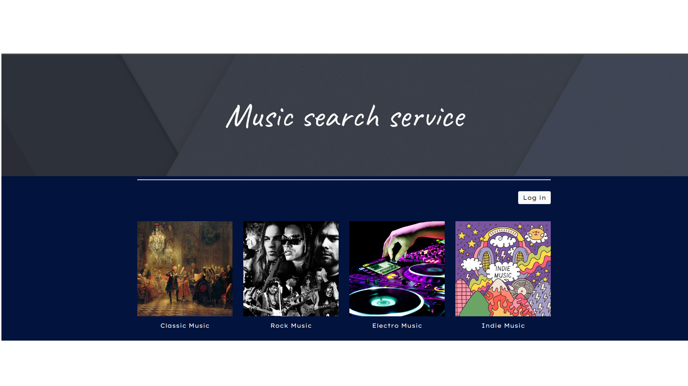

# 202306-mss

Учебный проект курса
[Kotlin Backend Developer](https://otus.ru/lessons/kotlin/?int_source=courses_catalog&int_term=programming).
Поток курса 2023-06.

MusicSearchService -- это площадка, на которой пользователи выставляют предложения и потребности. Задача
площадки -- предоставить наиболее подходящие варианты в обоих случаях: для предложения -- набор вариантов с
потребностями, для потребностей -- набор вариантов с предложениями.

## Визуальная схема фронтенда

## Документация

1. Маркетинг
    1. [Заинтересанты](./docs/01-marketing/01-stakeholders.md)
    2. [Целевая аудитория](./docs/01-marketing/02-target-audience.md)
    3. [Конкурентный анализ](./docs/01-marketing/03-concurrency.md)
    4. [Пользовательские истории](./docs/01-marketing/04-user-stories.md)
2. DevOps
    1. [Схема инфраструктуры](./docs/02-devops/01-infrastruture.md)
    2. [Схема мониторинга](./docs/02-devops/02-monitoring.md)
3. Тесты
4. Архитектура
    1. [Компонентная схема](./docs/04-architecture/01-arch.md)
    2. [Интеграционная схема](./docs/04-architecture/02-integration.md)
    3. [Описание API](./docs/04-architecture/03-api.md)

# Структура проекта

## Подпроекты для занятий по языку Kotlin

1. [m1l1-quickstart](m1l1-quickstart) - Вводное занятие, создание программы на Kotlin

## Транспортные модели, API

1. [specs](specs) - описание API в форме OpenAPI-спецификаций
2. [api-v1-kmp](api-v1-kmp) - Генерация первой версии транспортных моделей с KMP
3. [api-log](api-log) - Генерация первой версии моделей логирования
4. [common](common) - модуль с общими классами для модулей проекта. В частности, там
   располагаются внутренние модели и контекст.
5. [mappers-v1](mappers-v1) - Мапер между внутренними моделями и моделями API v1
6. [mappers-log](mappers-log) - Мапер между внутренними моделями и моделями логирования
   первой версии

## Фреймворки и транспорты

1. [app-ktor](app-ktor) - Приложение на Ktor JVM/Native
2. [app-kafka](app-kafka) - Микросервис на Kafka

## Мониторинг и логирование

1. [deploy](deploy) - Инструменты мониторинга и деплоя
2. [lib-logging-common](lib-logging-common) - Общие объявления для логирования
3. [lib-logging-logback](lib-logging-logback) - Библиотека логирования на базе библиотеки
   Logback

# Модули бизнес-логики

1. [stubs](stubs) - Стабы для ответов сервиса
2. [lib-cor](lib-cor) - Библиотека цепочки обязанностей для бизнес-логики
3. [biz](biz) - Модуль бизнес-логики приложения

# (## Хранение, репозитории, базы данных)

1. [repo-tests](repo-tests) - Базовые тесты для репозиториев всех баз данных

2. [repo-inmemory](repo-inmemory) - Репозиторий на базе кэша в памяти для тестирования

[//]: # (3. [repo-postgresql]&#40;repo-postgresql&#41; - Репозиторий на базе PostgreSQL)

[//]: # (### Функции &#40;эндпониты&#41;)

[//]: # ()

[//]: # (1. CRUDS &#40;create, read, update, delete, search&#41; для тем &#40;topic&#41;)

[//]: # ()

[//]: # (### Описание сущности topic)

[//]: # ()

[//]: # (1. Info)

[//]: # (    1. Title)

[//]: # (    2. Description)

[//]: # (    3. Owner)

[//]: # (    4. Status)

[//]: # (    5. Answers)

[//]: # (2. TopicId - идентификатор топика)
